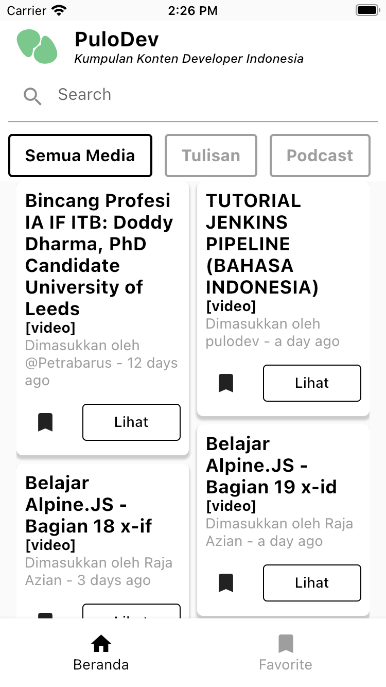

# Flutter Pulodev With State Management GetX

Create application PuloDev (Kumpulan konten developer Indonesia)

## Feature

1. Search content.
2. Filter media (web, tulisan, podcast atau video).
3. See the content with package url launcher for launch in app web view.
4. Pagination [Coming Soon]
5. Favorite with local storage [Coming Soon]
6. Change theme with dark and light theme [Coming Soon]

## Screenshot

| Home                                 | Favorite                              |
|--------------------------------------|---------------------------------------|
|  |  |

## Contact:

* Github: https://github.com/rsyd29
* Linkedin: https://linkedin.com/in/budimanrasyid